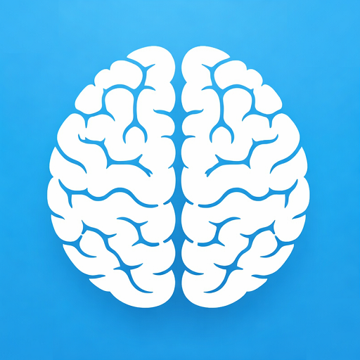

# KONTINUUM



**Dein Zuhause lernt selbst.**

[](https://github.com/hacs/integration)


> [English version](README_EN.md)

KONTINUUM ist eine experimentelle Home-Assistant-Integration, die dein Zuhause ohne Regeln, ohne Konfiguration und ohne Cloud versteht.

Statt Automationen manuell zu schreiben, beobachtet KONTINUUM den kontinuierlichen Strom von Ereignissen in deinem Zuhause, erkennt Muster in deinem Verhalten und sagt voraus, was als Nächstes passieren wird -- vollständig lokal und extrem ressourcenschonend.

Das Ziel ist radikal einfach:

**Installieren -- und vergessen. Dein Zuhause lernt den Rest.**

---

## Die Vision: Zero UI

Moderne Smart Homes sind oft komplizierter als das Leben selbst. Man erstellt Automationen, Dashboards, Szenen, Regeln und Skripte. Am Ende verbringt man mehr Zeit damit, das Haus zu programmieren, als darin zu leben.

KONTINUUM verfolgt eine andere Idee: **Zero UI**.

Ein intelligentes Zuhause sollte nicht programmiert werden müssen. Es sollte **verstehen**. Du installierst das System -- und es beginnt zu beobachten, zu lernen und zu verstehen.

---

## Warum der Name "KONTINUUM"?

Der Begriff *Kontinuum* stammt vom lateinischen *continuus* und bedeutet: **zusammenhängend, ohne Unterbrechung, lückenlos**.

Unser Alltag besteht nicht aus isolierten Ereignissen. Er ist ein kontinuierlicher Strom von Gewohnheiten und Routinen. KONTINUUM betrachtet dein Zuhause genau so -- als lebendes System aus Mustern statt als Sammlung von Regeln.

---

## Wie es funktioniert

```
Verhaltensfluss --> Muster --> Vorhersage --> Aktion
```

KONTINUUM beobachtet den Fluss von Ereignissen und erkennt darin wiederkehrende Sequenzen. Das Haus beginnt zu verstehen:

- wann du aufstehst
- welche Räume du nacheinander betrittst
- wann du das Licht brauchst
- welche Routinen sich täglich wiederholen

**Dein Zuhause wird nicht programmiert -- es lernt.**

### Beispiel

Eine typische Morgenroutine:

```
Tür Schlafzimmer geöffnet --> Bewegung Flur --> Bewegung Küche --> Kaffeemaschine
```

Nachdem diese Sequenz häufig beobachtet wurde, erkennt KONTINUUM das Muster. Ergebnis: Die Kaffeemaschine wird automatisch vorbereitet, noch bevor du daran denkst.

---

## Architektur: Inspiriert vom menschlichen Gehirn

```
Thalamus --> Hippocampus --> Cerebellum --> PFC --> Aktion
    |             |              |           |
Hypothalamus   Spatial     Basalganglien  Amygdala
    |          Cortex      (Belohnung)
  Insula <-------+
                  |
            Cortex (optional, LLM-Agents)
```

### Kernmodule (immer aktiv, kein LLM nötig)

| Modul | Funktion |
|-------|----------|
| **Thalamus** | Sensorisches Tor -- filtert Events, erkennt Räume und Semantik, kennt den Sonnenstand |
| **Hippocampus** | Gedächtnis -- lernt Sequenzen mit N-Gramm-Markov-Ketten (1- bis 4-Gramme), unterscheidet Werktag/Wochenende |
| **Hypothalamus** | Homöostase -- beobachtet Temperatur-, Energie- und Solar-Trends |
| **Spatial Cortex** | Raumwahrnehmung -- analysiert Bewegungen, lernt Wege, sagt nächsten Raum vorher |
| **Insula** | Körpergefühl -- erkennt Modi (schlafen, aktiv, entspannen, abwesend), nutzt Sonnenstand |
| **Cerebellum** | Reflexe -- extrahiert stabile Routinen als deterministische Regeln |
| **Basalganglien** | Belohnungslernen -- Go/NoGo-Pathways, Q-Values, Gewohnheiten |
| **Amygdala** | Risikobewertung -- kann Veto einlegen bevor etwas Unerwünschtes passiert |
| **Präfrontaler Kortex** | Entscheidung -- wägt Vorhersagen ab, bewertet Nutzen gegen Risiko |

### Cortex -- Bewusstes Denken (optional, LLM-Agents)

> **KONTINUUM funktioniert vollständig ohne LLM.** Der Cortex ist ein optionales Upgrade für komplexe Entscheidungen. Das Kernlernen (Muster, Routinen, Vorhersagen) läuft immer lokal und ohne Cloud.

Wenn aktiviert, können bis zu **4 LLM-Agents** konfiguriert werden:

| Rolle | Aufgabe |
|-------|---------|
| **Comfort** | Optimiert Beleuchtung, Temperatur und Stimmung |
| **Energy** | Überwacht Solar, Batterie und Verbrauch |
| **Safety** | Erkennt Anomalien und hat Veto-Recht |
| **Coordinator** | Sieht alle Vorschläge der anderen Agents und trifft die finale Entscheidung per LLM |
| **Custom** | Eigene Rolle mit eigenem System-Prompt |

**Unterstützte Provider:** Ollama (lokal), OpenAI, Claude, Gemini, Grok -- alle über pure HTTP (kein SDK nötig).

**Ablauf einer Cortex-Beratung:**

1. **Runde 1** -- Worker-Agents (Comfort, Energy, Safety) denken parallel
2. **Runde 2** -- Bei Uneinigkeit: Agents sehen alle Vorschläge und können revidieren
3. **Entscheidung** -- Coordinator entscheidet per LLM, oder algorithmischer Konsens (Veto > Einigkeit > Mehrheit > Priorität)
4. **Safety-Veto hat immer absoluten Vorrang** -- auch vor dem Coordinator

**Cortex Bridge:** LLM-Ergebnisse fließen zurück ins Gehirn -- Hippocampus speichert sie als Erfahrung, Basalganglien lernen daraus, Amygdala bewertet Risiken, Cerebellum bildet neue Reflexe. KONTINUUM wird langfristig klüger, auch wenn der Cortex später deaktiviert wird.

**Brain Review:** Monatlich (oder manuell per Service) analysieren alle Cortex-Agents gemeinsam den Brain-Zustand und liefern einen Health-Score mit konkreten Verbesserungsvorschlägen.

---

## Installation

### HACS (Custom Repository)

1. HACS öffnen --> Integrationen --> Drei-Punkte-Menü --> Custom Repositories
2. URL: `https://github.com/Chance-Konstruktion/ha-kontinuum`
3. Kategorie: Integration
4. Installieren und neustarten

### Manuell

1. Kopiere `custom_components/kontinuum/` nach `/config/custom_components/kontinuum/`
2. Starte Home Assistant neu

### Einrichtung

3. **Einstellungen --> Integrationen --> + Hinzufügen --> KONTINUUM**
4. Wähle eine Persönlichkeit
5. Optional: Dashboard aktivieren

Danach beginnt KONTINUUM automatisch zu lernen. **Keine weitere Konfiguration nötig.**

---

## Persönlichkeits-Presets

Bei der Installation wählst du wie schnell KONTINUUM lernt:

| Preset | Lerngeschwindigkeit | Erste Regeln nach | Fehlertoleranz |
|--------|--------------------|--------------------|----------------|
| **Mutig** | Schnell | ~1 Tag | Hoch (lernt aus Fehlern) |
| **Ausgeglichen** | Mittel | ~3 Tage | Mittel |
| **Konservativ** | Langsam | ~1 Woche | Niedrig |

Nachträglich änderbar: Integrationen --> KONTINUUM --> Konfigurieren

---

## Cortex (LLM-Agents) einrichten

> Optional -- KONTINUUM funktioniert vollständig ohne diesen Schritt.

1. Integrationen --> KONTINUUM --> Konfigurieren
2. **Enable Cortex** aktivieren
3. Agent konfigurieren:
   - **Rolle** wählen (Comfort / Energy / Safety / Coordinator / Custom)
   - **Provider** wählen (Ollama, OpenAI, Claude, Gemini, Grok)
   - **URL** eingeben -- bei Ollama reicht z.B. `localhost` oder `192.168.1.100`
4. Im nächsten Schritt: **Modell auswählen**
   - Bei Ollama werden alle installierten Modelle als Dropdown angezeigt
   - Bei Cloud-Providern wird das Default-Modell vorgeschlagen
5. Optional: Weitere Agents hinzufügen (bis zu 4)

**Tipp:** Der 4. Agent-Slot ist ideal für den **Coordinator**, der als "Chef" über die anderen 3 Worker-Agents entscheidet.

### Ollama-Tipps

```bash
# Ollama installieren
curl -fsSL https://ollama.ai/install.sh | sh

# Modell herunterladen
ollama pull llama3.2

# Installierte Modelle anzeigen
ollama list
```

---

## Dashboard

KONTINUUM enthält ein interaktives Gehirn-Visualisierungs-Dashboard. Wenn bei der Installation aktiviert, erscheint es als **Sidebar-Eintrag** in Home Assistant:

- Sidebar --> **KONTINUUM** (Brain-Icon)
- Oder direkt: `/kontinuum`

### Was zeigt das Dashboard?

- **SVG-Gehirn-Karte** mit allen 9 Modulen -- animierte Aktivierung bei Events
- **Sensorik-Panel** -- Last Event, Prediction, Accuracy, Energy in Echtzeit
- **Kontext-Panel** -- aktueller Raum, Modus, Cerebellum-Status
- **Modul-Details** -- Jedes Gehirnmodul zeigt seine Statistiken (Entities, Patterns, Decisions, etc.)
- **Connection-Status** -- Grün (verbunden), Rot (Fehler), Amber (verbinde...)
- **Event-Log** -- Live-Stream der erkannten Events mit Farb-Kodierung

### Debug-Panel

Das Dashboard hat einen integrierten **Debug-Modus** (Toggle oben rechts). Dieser zeigt:

- **Cortex-Status** -- Agents, Beratungen, Diskussionen, letzter Konsens
- **Vorschläge und Revisionen** -- Was jeder Agent in Runde 1 und 2 vorgeschlagen hat
- **Brain Review** -- Health-Score und Verbesserungsvorschläge

Im Debug-Panel können folgende **Services direkt ausgelöst** werden:

| Button | Service | Was passiert? |
|--------|---------|---------------|
| **Cortex Consult** | `kontinuum.cortex_consult` | Löst manuell eine Beratung aller Cortex-Agents aus. Die Agents analysieren den aktuellen Zustand und geben Vorschläge. Ergebnis als Notification. |
| **Brain Review** | `kontinuum.brain_review` | Alle Cortex-Agents analysieren gemeinsam den Brain-Zustand (Patterns, Accuracy, Regeln, Habits). Liefert Health-Score + Verbesserungsvorschläge. |
| **Status** | `kontinuum.status` | Zeigt detaillierten KONTINUUM-Status als persistent_notification -- Version, Module, Statistiken. |
| **Brain Export** | `kontinuum.export_brain` | Exportiert die komprimierte brain.json.gz als lesbare brain_export.json nach /config/. Für externe Analyse. |
| **Activate Light** | `kontinuum.activate` | Schaltet autonome Ausführung für Lichter frei. KONTINUUM steuert dann Lichter selbständig basierend auf gelernten Mustern. |
| **Deactivate All** | `kontinuum.deactivate` | Deaktiviert autonome Ausführung für alle Gerätetypen. KONTINUUM beobachtet dann nur noch (Shadow-Mode). |

---

## Sensoren

KONTINUUM erstellt automatisch native HA-Entitäten -- kein YAML nötig.

### System-Sensoren

| Sensor | Beschreibung |
|--------|-------------|
| `sensor.kontinuum_status` | Systemstatus + Version + alle Modul-Statistiken |
| `sensor.kontinuum_events` | Anzahl verarbeiteter Events |
| `sensor.kontinuum_accuracy` | Vorhersagegenauigkeit (Shadow-Mode Hit-Rate) |
| `sensor.kontinuum_mode` | Aktueller Modus (sleeping, active, relaxing, ...) |
| `sensor.kontinuum_room` | Erkannter Raum |
| `sensor.kontinuum_location` | Standort mit Presence-Map |
| `sensor.kontinuum_persons_home` | Personen zuhause |
| `sensor.kontinuum_prediction` | Aktuelle Vorhersage + Konfidenz |
| `sensor.kontinuum_energy` | Energiezustand + Solar + Trends |
| `sensor.kontinuum_cerebellum` | Gelernte Routinen (Regelanzahl, Fired) |
| `sensor.kontinuum_basal_ganglia` | Habits + Go/NoGo + Q-Values |
| `sensor.kontinuum_unknown_entities` | Entities ohne Raumzuordnung |

### Cortex Agent-Sensoren (nur bei aktiviertem Cortex)

Pro konfiguriertem Agent wird ein Sensor erstellt:

| Sensor | Beschreibung |
|--------|-------------|
| `sensor.kontinuum_cortex_agent_1` | Status Agent 1 (active/idle/error) |
| `sensor.kontinuum_cortex_agent_2` | Status Agent 2 |
| `sensor.kontinuum_cortex_agent_3` | Status Agent 3 |
| `sensor.kontinuum_cortex_agent_4` | Status Agent 4 (z.B. Coordinator) |

Attribute pro Agent: `role`, `provider`, `model`, `total_calls`, `total_errors`, `error_rate`, `last_call`

### Aktivitäts-Sensoren (Dashboard-Gauges)

Zeigen die Aktivität jedes Gehirnmoduls (0.0 -- 1.0):

| Sensor | Modul |
|--------|-------|
| `sensor.kontinuum_thalamus_activity` | Verarbeitungsrate |
| `sensor.kontinuum_hippocampus_activity` | Lerngenauigkeit |
| `sensor.kontinuum_hypothalamus_activity` | Energie-Trends |
| `sensor.kontinuum_amygdala_activity` | Risiko-Level |
| `sensor.kontinuum_insula_activity` | Modus-Konfidenz |
| `sensor.kontinuum_cerebellum_activity` | Regelabdeckung |
| `sensor.kontinuum_prefrontal_activity` | Entscheidungsrate |
| `sensor.kontinuum_spatial_activity` | Raum-Konfidenz |
| `sensor.kontinuum_basalganglia_activity` | Gewohnheitsstärke |

---

## Services

### Kern-Services (immer verfügbar)

| Service | Beschreibung |
|---------|-------------|
| `kontinuum.status` | Detaillierten Status als Notification anzeigen |
| `kontinuum.export_brain` | Gehirn als lesbare JSON exportieren (brain_export.json) |
| `kontinuum.activate` | Autonome Ausführung für einen Gerätetyp freischalten (light, switch, fan, cover, climate, media, automation, vacuum) |
| `kontinuum.deactivate` | Autonome Ausführung deaktivieren (pro Typ oder `all`) |
| `kontinuum.enable_scenes` | Automatische Licht-Szenen nach erkanntem Modus aktivieren |
| `kontinuum.disable_scenes` | Licht-Szenen deaktivieren |
| `kontinuum.set_scene` | Licht-Szene pro Modus konfigurieren (Helligkeit, Farbtemperatur) |

### Cortex-Services (nur bei aktiviertem Cortex)

| Service | Beschreibung |
|---------|-------------|
| `kontinuum.cortex_consult` | Manuelle Beratung aller Cortex-Agents auslösen |
| `kontinuum.brain_review` | Brain-Analyse durch alle Agents (Health-Score + Vorschläge) |
| `kontinuum.configure_agent` | Agent per Service konfigurieren (Slot 1-4) |
| `kontinuum.remove_agent` | Agent aus Slot entfernen |

---

## Events

| Event | Beschreibung |
|-------|-------------|
| `kontinuum_mode_changed` | Feuert bei Moduswechsel (old_mode, new_mode, confidence, room) |

Kann für eigene Automationen genutzt werden:

```yaml
trigger:
  platform: event
  event_type: kontinuum_mode_changed
  event_data:
    new_mode: sleeping
action:
  service: light.turn_off
  target:
    area_id: bedroom
```

---

## Technische Details

- **Kein ML, kein Deep Learning** -- reine Statistik (1- bis 4-Gramm Markov-Ketten)
- **Komplett lokal** -- keine Cloud, keine API-Calls (Cortex optional)
- **~6.000 Zeilen Python** -- läuft auf Raspberry Pi 4
- **21-dimensionaler Kontextvektor** -- Zeit, Sonnenstand, Energie, Trends, Modus
- **Adaptive Kontext-Buckets** -- wächst von 6 auf 96 (Zeit x Modus x Energie x Tagestyp)
- **Persistenz** -- Gehirn wird in `brain.json.gz` komprimiert gespeichert (RPi-SD-schonend)
- **Shadow-Mode** -- beobachtet und validiert Vorhersagen bevor es handelt
- **Label-Support** -- HA-Labels als Raum-Hinweis nutzbar
- **Saubere Deinstallation** -- Entfernt brain, Helfer und Entities automatisch
- **Cortex Bridge** -- LLM-Ergebnisse fließen ins Gehirn zurück
- **Multi-Agent-Diskussion** -- Agents diskutieren und finden Konsens
- **Coordinator-Agent** -- Optional: 4. Agent als LLM-basierter Entscheider
- **Ollama Model Discovery** -- Config Flow erkennt installierte Modelle automatisch

---

## Vergessen und saisonale Muster

Ein intelligentes System muss nicht nur lernen -- es muss auch **vergessen** können.

KONTINUUM verwendet einen Decay-Mechanismus. Alte Muster verlieren langsam an Gewicht, während neue Gewohnheiten wichtiger werden.

- **Winter:** Heizung wird regelmäßig aktiviert
- **Sommer:** das gleiche Ereignis führt nicht mehr zur Heizung

---

## Projektstatus

KONTINUUM ist ein experimentelles Forschungsprojekt.

Das Ziel ist nicht nur eine weitere Smart-Home-Integration, sondern die Erforschung einer grundlegenden Frage:

> Kann ein Zuhause seine Bewohner verstehen, ohne programmiert zu werden?

---

## Philosophie

> Die beste Technologie ist die, die man nicht bemerkt.

Wenn KONTINUUM perfekt funktioniert, passiert etwas Merkwürdiges: Du denkst nicht mehr über dein Smart Home nach. Es funktioniert einfach.

So wie ein Zuhause es sollte.

---

**Lerne ein Wort. Dein Zuhause lernt den Rest.**

*KONTINUUM*

---

## Lizenz

MIT License -- siehe [LICENSE](LICENSE)
